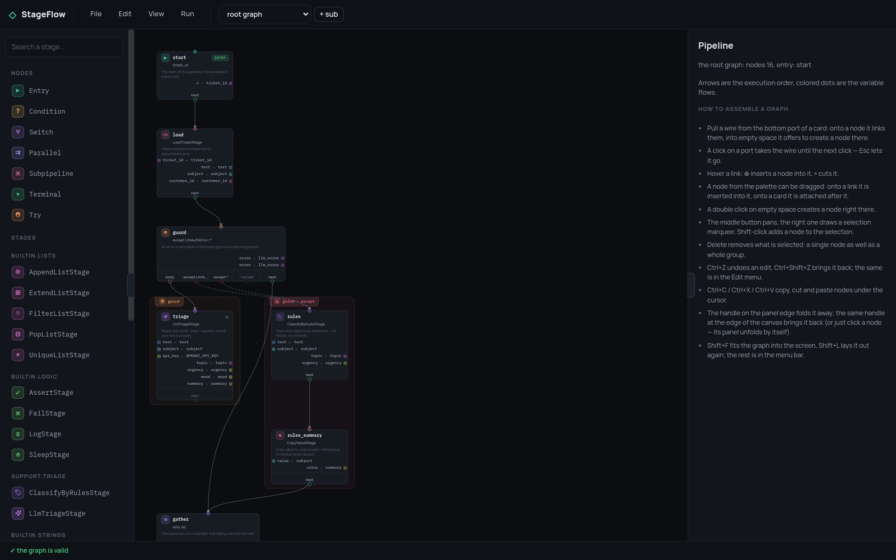

<div align="center">

# StageFlow example: a support bot

**A working StageFlow backend to point the editor at — four pipelines that grow
from four nodes to the whole bot.**

[](https://github.com/leo-need-more-coffee/stageflow-example/actions/workflows/tests.yml)
[](LICENSE)

[Core](https://github.com/leo-need-more-coffee/stageflow) ·
[Editor](https://github.com/leo-need-more-coffee/stageflow-ui) ·
[Tutorial](https://leo-need-more-coffee.github.io/stageflow/tutorial/)

</div>



The bot takes a support ticket, works out what it is about, looks for an answer
in a knowledge base, and either writes a reply or hands the ticket to a person.
Everything it works on is prepared data in `data/`, so a run gives the same
result every time.

This is the backend the [editor](https://github.com/leo-need-more-coffee/stageflow-ui)
talks to: it serves the stage specifications, executes runs on the real core
with the step debugger, and streams the events back. It is also the bot the
[tutorial](https://leo-need-more-coffee.github.io/stageflow/tutorial/) builds
step by step.

## Run it

```bash
pip install -r requirements.txt
python main.py                 # http://127.0.0.1:8765
```

Open the editor, type `http://127.0.0.1:8765` on the connection screen, then
"File" → "Import JSON…" to open a pipeline from `pipelines/` and "Run" →
"Debug step by step" to walk it a node at a time.

`uvicorn main:app --reload` is the same server with reloading while you edit a
stage. `http://127.0.0.1:8765/docs` lists every endpoint and can start a run
without the editor.

**Without an API key** the fourth pipeline still runs end to end: the model
failing is a road on the graph, and it leads to the keyword rules. The first
three stop at the triage node with `LlmAuthError`, which is worth stepping
through once.


## The four pipelines

The same bot at four sizes; each one adds exactly one idea.

| File | Nodes | What is new |
|---|---|---|
| `01-triage.json` | 4 | a straight line: load a ticket, let the model read it |
| `02-auto-reply.json` | 10 | a knowledge base search and the first `condition` |
| `03-routing.json` | 13 | `parallel` and a `switch` on urgency |
| `04-support-bot.json` | 16 + 5 | `try`/`except` down to keyword rules, `retry`, and a subpipeline that writes the reply |

## The stages

`app/stages/support.py` — prepared data, no network:

| Stage | What it does |
|---|---|
| `LoadTicketStage` | takes a ticket out of `data/tickets.json` |
| `LoadCustomerStage` | the customer's plan and promised answer time |
| `ClassifyByRulesStage` | topic and urgency by keywords: the road taken when the model is unavailable |
| `SearchKnowledgeStage` | finds an article, or reports that nothing matched |
| `RenderReplyStage` | fills `{ticket_id}` and friends into an article |
| `SendReplyStage` | sends the reply, streaming it word by word |
| `EscalateStage` | creates a task for a person and says why |

`app/stages/llm.py` — the two that call a model: `LlmTriageStage` reads the
ticket into a strict JSON schema, `LlmReplyStage` writes the reply as a stream.
Their four error classes (`LlmAuthError`, `LlmRateLimited`, `LlmUnavailable`,
`LlmBadAnswer`) are what the graph routes on.

## Keys

The key is given to the server, not to the pipeline:

```bash
SF_SECRET_OPENAI_API_KEY=sk-… python main.py
```

The editor then sees only the name `OPENAI_API_KEY` and the pipelines read it
as an ordinary variable; the value is substituted when a run starts and masked
everywhere on the way back.

| Variable | What it does |
|---|---|
| `SF_HOST`, `SF_PORT` | where to listen (default `127.0.0.1:8765`); `python main.py 9000` also works |
| `SF_SECRETS`, `SF_SECRET_<NAME>` | the secrets a run may use; the editor only ever sees their names |
| `SF_ALLOW_ORIGIN` | the origin allowed by CORS (default `*`) |
| `OPENAI_API_KEY`, `OPENAI_BASE_URL`, `OPENAI_MODEL` | read by the two model stages |

`OPENAI_BASE_URL` points them at any OpenAI-compatible gateway, proxy or local
stub, which is how to try the first three pipelines without a real key.

## What it answers

```
GET    /api/stages             the specs of every registered stage
GET    /api/secrets            the NAMES of the secrets in the environment
POST   /api/run                {pipeline, vars, mode: "run"|"step", delay} -> {id, state}
GET    /api/run/<id>           the state of the run
GET    /api/run/<id>/events    the event stream (SSE), ?from=N — read on from the Nth
POST   /api/run/<id>/control   {action: "step"|"resume"|"pause"|"stop"|"delay", count, delay}
POST   /api/run/<id>/vars      {set: {...}, drop: [...]}
```

Plus `/docs`, and the three folders the editor may ask for: `icons/`,
`pipelines/`, `data/`. Every answer carries CORS headers. The protocol itself
is documented in the editor's
[backend guide](https://github.com/leo-need-more-coffee/stageflow-ui/blob/main/docs/backend.md)
— there is nothing special about this implementation.

## Layout

```
main.py                 the FastAPI app: middleware, error handlers, static files
app/api.py              every endpoint the editor calls
app/schemas.py          the bodies of the run API
app/runs.py             a run: a real Session in its own thread, with the debugger
app/events.py           the event log and the SSE stream out of it
app/secrets.py          which secrets the server has, and masking them again
app/stages/             the stages of the bot
pipelines/, data/       the four pipelines and the prepared situations
```

## After an edit

```bash
python check_pipelines.py
```

Validates every pipeline the way the core does and runs the full one without a
key, down both roads: an answered ticket and an escalated one.

## License

MIT — see [LICENSE](LICENSE).
