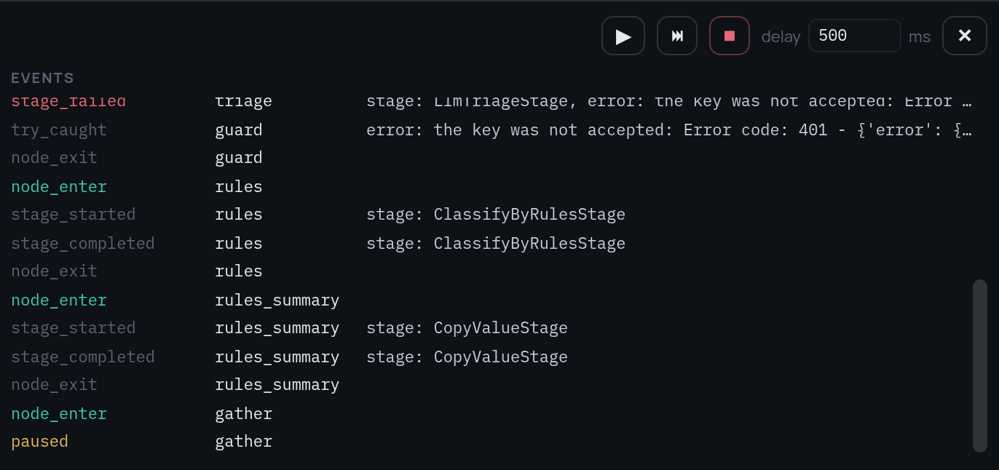

<div align="center">

# StageFlow example: a support bot

**A working StageFlow backend to point the editor at — four pipelines that grow
from four nodes to the whole bot.**

[](https://github.com/leo-need-more-coffee/stageflow-example/actions/workflows/tests.yml)
[](LICENSE)

[Core](https://github.com/leo-need-more-coffee/stageflow) ·
[Editor](https://github.com/leo-need-more-coffee/stageflow-ui) ·
[Tutorial](https://leo-need-more-coffee.github.io/stageflow/tutorial/)

</div>


The bot takes a support ticket, works out what it is about, looks for an answer
in a knowledge base, and either writes a reply or hands the ticket to a person.
Everything it works on is prepared data in `data/`, so a run gives the same
result every time.

This is the backend the [editor](https://github.com/leo-need-more-coffee/stageflow-ui)
talks to: it serves the stage specifications, executes runs on the real core
with the step debugger, and streams the events back. It is also the bot the
[tutorial](https://leo-need-more-coffee.github.io/stageflow/tutorial/) builds
step by step.

## Run it

```bash
pip install -r requirements.txt
python main.py                 # http://127.0.0.1:8765
```

Open the editor, type `http://127.0.0.1:8765` on the connection screen, then
"File" → "Import JSON…" to open a pipeline from `pipelines/` and "Run" →
"Debug step by step" to walk it a node at a time.

`uvicorn main:app --reload` is the same server with reloading while you edit a
stage. `http://127.0.0.1:8765/docs` lists every endpoint and can start a run
without the editor.

**Without an API key** the fourth pipeline still runs end to end: the model
failing is a road on the graph, and it leads to the keyword rules. The first
three stop at the triage node with `LlmAuthError`, which is worth stepping
through once.



## The six pipelines

The same bot at six sizes; each one adds exactly one idea, and between them
they use every node type the core has.

| File | Nodes | What is new | Runs on |
|---|---|---|---|
| `01-triage.json` | 4 | a straight line: load a ticket, let the model read it | pro, full |
| `02-auto-reply.json` | 10 | a knowledge base search and the first `condition` | pro, full |
| `03-routing.json` | 13 | `parallel` and a `switch` on urgency | pro, full |
| `04-support-bot.json` | 16 + 5 | `try`/`except` down to keyword rules, `retry`, and a subpipeline that writes the reply | pro, full |
| `05-batch-triage.json` | 6 | `map`: one region of the graph run once per ticket, in parallel, collecting the verdicts | pro, full |
| `06-rules-only.json` | 12 | the whole bot with no model at all — the pipeline the `basic` plan is built around | every plan |

The last two exist to make the plans mean something. `06-rules-only` is what a
tier without model access still gets: keywords decide the topic, the knowledge
base answers, and anything it cannot answer goes to a person. `05-batch-triage`
needs the `map` node, which `basic` does not have — open it on that plan and
the editor greys the node out and says why, before anybody presses Run.

## The stages

`app/stages/support.py` — prepared data, no network:

| Stage | What it does |
|---|---|
| `LoadTicketStage` | takes a ticket out of `data/tickets.json` |
| `LoadCustomerStage` | the customer's plan and promised answer time |
| `ClassifyByRulesStage` | topic and urgency by keywords: the road taken when the model is unavailable |
| `SearchKnowledgeStage` | finds an article, or reports that nothing matched |
| `RenderReplyStage` | fills `{ticket_id}` and friends into an article |
| `SendReplyStage` | sends the reply, streaming it word by word |
| `EscalateStage` | creates a task for a person and says why |

`app/stages/llm.py` — the two that call a model: `LlmTriageStage` reads the
ticket into a strict JSON schema, `LlmReplyStage` writes the reply as a stream.
Their four error classes (`LlmAuthError`, `LlmRateLimited`, `LlmUnavailable`,
`LlmBadAnswer`) are what the graph routes on.

### What a run costs

Most of these stages are free and say so by declaring nothing: reading a JSON
file costs the platform nothing worth counting, and a meter nobody needs is a
number in the way. The rest take part in the budget, and between them they show
both halves of it:

| Stage | Reserves | Charges | Why that way round |
|---|---|---|---|
| `LlmTriageStage`, `LlmReplyStage` | `llm_calls`, `tokens` by the length of the arguments | `llm_calls`, `tokens` from the provider's `usage` | expensive: a call that cannot be paid for should not be sent, and what it really came to is known only afterwards |
| `SearchKnowledgeStage` | — | `kb_lookups` | costs the same whatever it is given; nothing to gate a run on |
| `SendReplyStage` | — | `replies_sent`, `reply_chars` | neither is known before the reply exists |
| `EscalateStage` | — | `escalations` | the most expensive thing this bot can do is take up a person's time |

None of those names is the core's. `kb_lookups`, `replies_sent`, `escalations`
are units of *this* business, which is the point: a host counts what is scarce
for it, and what a unit is worth is a price list that changes without any code
changing. The plans below put ceilings on them, and `result.meters` is what an
invoice would be built from.

## Keys

The key is given to the server, not to the pipeline:

```bash
SF_SECRET_OPENAI_API_KEY=sk-… python main.py
```

The editor then sees only the name `OPENAI_API_KEY` and the pipelines read it
as an ordinary variable; the value is substituted when a run starts and masked
everywhere on the way back.

| Variable | What it does |
|---|---|
| `SF_HOST`, `SF_PORT` | where to listen (default `127.0.0.1:8765`); `python main.py 9000` also works |
| `SF_SECRETS`, `SF_SECRET_<NAME>` | the secrets a run may use; the editor only ever sees their names |
| `SF_ALLOW_ORIGIN` | the origin allowed by CORS (default `*`) |
| `SF_TOKENS` | `token:plan,token:plan` — configure one and every endpoint starts demanding a credential |
| `SF_AUTH_HEADER` | which header it arrives in (default `Authorization`) |
| `OPENAI_API_KEY`, `OPENAI_BASE_URL`, `OPENAI_MODEL` | read by the two model stages |

`OPENAI_BASE_URL` points them at any OpenAI-compatible gateway, proxy or local
stub, which is how to try the first three pipelines without a real key.

## How it was built

The core's documentation takes this repository apart step by step —
[Building a backend](https://leo-need-more-coffee.github.io/stageflow/backend/):
the stages, the seven endpoints, the policy, the meters and the credential,
in the order they were actually written. If you are writing a backend of your
own rather than reading this one, start there.

## Plans, and where a plan is checked

Three plans (`app/plans.py`), each of them a `Policy`: which stages and node
types may be composed, and how much a run may spend.

| | `basic` | `pro` | `full` |
|---|---|---|---|
| stages | the seven rules-only ones, plus the core's plumbing | all | all |
| node types | entry, stage, condition, switch, terminal | all | all |
| `seconds` / `steps` | 15 / 200 | 120 / 5 000 | — |
| `tokens` / `llm_calls` | no model at all | 200 000 / 100 | — |
| `kb_lookups` / `replies_sent` / `escalations` | 20 / 1 / 1 | 2 000 / 200 / 50 | — |
| `concurrency` / `depth` | 2 / 2 | 8 / 4 | — |
| retry | 2 attempts, 2 s apart | 5 attempts, 30 s apart | — |

`basic` is a tier that still works: it runs `06-rules-only.json` end to end.
That is deliberate — a plan that can run nothing at all teaches nothing about
plans, and this repository has had one of those.

Who is on which is decided by a token (`app/auth.py`):

```bash
SF_TOKENS="demo-basic:basic,demo-pro:pro" python main.py
```

The editor then asks for the header on its connection screen. With no tokens
configured there is no authentication at all and everyone gets `full` — the
example starts and works, which is the point of an example.

The part worth looking at is the asymmetry between the two halves:

| | Who may ask | What it is for |
|---|---|---|
| `GET /api/meta?plan=pro` | anyone | *show* me what that plan allows — an unverified question, so that an editor can grey out a palette without anybody logging in, and so that "what would I lose on the cheaper tier" is answerable |
| `POST /api/run` | the credential decides | the plan is resolved from the header and nowhere else. `plan` in the body is what the client *drew against*; if it disagrees the run is refused with a message that names both, rather than narrowed in silence |

Wire `?plan=` into the run — one line, and an obvious-looking one — and every
ceiling in this repository becomes a query parameter. `check_pipelines.py`
checks that nobody did.

None of this is in the framework. StageFlow takes a `Policy`; tokens,
headers, tenants and sessions are the platform's, because every platform
already has its own and would have to fight the framework's.

## What it answers

```
GET    /api/meta               {api, plan, plan_source, plans, stageflow, node_types, stages, limits}
                               ?plan=<name> — answer about that plan instead of the caller's
GET    /api/stages             the specs of the stages the plan allows; ?plan= as above
GET    /api/secrets            the NAMES of the secrets in the environment
POST   /api/run                {pipeline, vars, mode: "run"|"step", delay, plan} -> {id, state}
GET    /api/run/<id>           the state of the run
GET    /api/run/<id>/events    the event stream (SSE), ?from=N — read on from the Nth
POST   /api/run/<id>/control   {action: "step"|"resume"|"pause"|"stop"|"delay", count, delay}
POST   /api/run/<id>/vars      {set: {...}, drop: [...]}
```

Plus `/docs`, and the three folders the editor may ask for: `icons/`,
`pipelines/`, `data/`. Every answer carries CORS headers. The protocol itself
is documented in the editor's
[backend guide](https://github.com/leo-need-more-coffee/stageflow-ui/blob/main/docs/backend.md)
— there is nothing special about this implementation.

## Layout

```
main.py                 the FastAPI app: middleware, error handlers, static files
app/api.py              every endpoint the editor calls
app/auth.py             who is calling, and therefore which plan a run is on
app/plans.py            the plans, each one a Policy
app/schemas.py          the bodies of the run API
app/runs.py             a run: a real Session in its own thread, with the debugger
app/events.py           the event log and the SSE stream out of it
app/secrets.py          which secrets the server has, and masking them again
app/stages/             the stages of the bot
pipelines/, data/       the four pipelines and the prepared situations
```

## After an edit

```bash
python check_pipelines.py
```

Validates every pipeline the way the core does and runs the full one without a
key, down both roads: an answered ticket and an escalated one.

## License

MIT — see [LICENSE](LICENSE).
